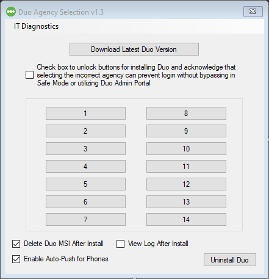

# duo-installer-win
- Created using Powershell Studio 2021

- Duo API Keys and Button Text Label changes can be made in the duokeys.example.ps1 file. When done, copy and rename to duokeys.ps1 so that it can be built into the exe

- Screenshot of main window

